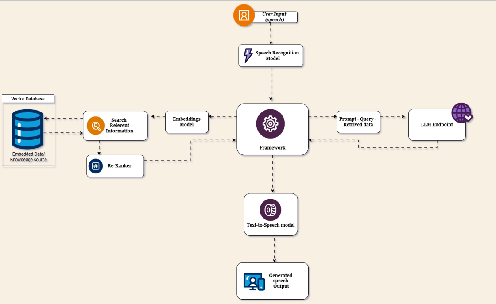

-- Tech stack -- 

User Voice Input:
(No model – audio capture)

Speech-to-Text:
Model: Faster Whisper

Dense Retrieval & Re-Ranking:
Query Embedding: Azure OpenAI Embeddings

Retrieval: FAISS Index, Cosine Similarity

Re-Ranking: Cross-Encoder (ms-marco-MiniLM-L-6-v2)

Response Generation:
Model: Azure OpenAI Chat (GPT-4) - change according to usecase

Text-to-Speech:
Model: Bark TTS (Opensource, with a fixed voice preset)

This architecture outlines the main components and the associated models used at each step of our system.
